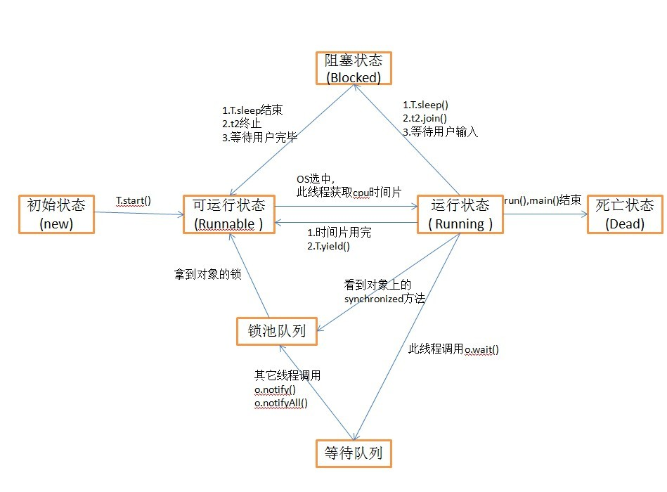

# 1. 线程概述
* 线程是进程中的一个执行单元，是CPU调度和分派的基本单位，它是比进程更小的能独立运行的基本单位。
* **线程和进程的区别**
  * 一个线程只能属于一个进程, 一个进程可以拥有多个线程.
  * 进程在执行过程中拥有独立的内存单元, 而多个线程共享进程的内存单元.(同一个进程中的多个线程共享**代码段**, **数据段**(全局变量和静态变量), **扩展段**(堆和栈). 每个线程都有自己的栈段, 即**运行时段**, 用于存储所有的局部变量和临时变量.)
  * 进程是资源分配的最小单位, 线程是CPU调度的最小单位.
  * 进程上下文切换的开销远大于线程切换的开销.
  * 进程间通信(IPC), 线程间可以直接读写进程数据段中的数据(如全局变量, 通信中需要进程同步和互斥手段的辅助, 以保证数据的一致性), 而进程间通信需要以**消息传递**的方式进行.
  * 进程编程调试简单可靠, 但创建和销毁的开销大; 线程编程调试复杂, 但创建和销毁的开销小.
  * 进程间不会互相影响; 在进程中一个线程崩溃, 将导致整个进程崩溃.
  * 进程适应与多核, 多机分布; 线程适用于多核.

# 2. 多线程编程
* 使用C语言的pthread库实现多线程编程
* 主要使用的函数:
  * 线程ID: `pthread_t`类型, 用于标识线程, 原型是`typedef unsigned long int pthread_t;`
  * 获取当前线程ID: `pthread_t pthread_self(void)`
  * 创建一个子线程:
    * `int pthread_create(pthread_t *thread, const pthread_attr_t *attr, void *(*start_routine) (void *), void *arg);`
    > **参数说明**
    > * thread: 用于返回新创建的线程ID
    > * attr: 线程属性, 一般设置为NULL
    > * start_routine: 线程运行函数指针
    > * arg: 传递给线程运行函数的参数
  * 线程退出: `void pthread_exit(void *retval);`
    > retval: 线程退出时返回的值, 如果不需要返回值, 则设置为NULL
    > 使用这个函数, 可以让线程正常退出, 释放资源, 不会影响到其他线程, 也可以用于主线程.
  * 等待子线程退出: `int pthread_join(pthread_t thread, void **retval);`
    > **参数说明**
    > * thread: 要等待的线程ID
    > * retval: 用于返回线程退出时的返回值
    > 返回值: 成功返回0, 失败返回错误码
    > **此函数是一个阻塞函数, 如果还有子线程还在运行, 调该函数就会阻塞, 子线程退出函数解除阻塞进行资源的回收, 函数被调用一次, 只能回收一个子线程.
  * 分离线程: `int pthread_detach(pthread_t thread);`
    > **参数说明**
    > * thread: 要分离的线程ID
    > 返回值: 成功返回0, 失败返回错误码
    > 此函数用于将线程设置为分离状态, 分离状态的线程不需要等待, 也不需要被其他线程回收, 线程退出后, 会由系统自动回收资源, 而非进程.
  * 线程取消: `int pthread_cancel(pthread_t thread);`
    > **参数说明**
    > * thread: 要取消的线程ID
    > 返回值: 成功返回0, 失败返回错误码
    > 此函数用于杀死线程.

* **线程的状态:**
  1. 创建状态(NUW): 线程创建后, 还没有运行, 就处于创建状态.
  2. 可运行状态(RUNNABLE): 线程创建后, 就处于可运行状态, 等待CPU调度.
  3. 运行状态(RUNNING): 线程被CPU调度后, 就处于运行状态.
  4. 阻塞状态(BLOCKED): 线程在运行过程中, 因为某些原因, 暂时不能运行, 就处于阻塞状态, 一旦条件满足, 就会转换为可运行状态.
   > 阻塞状态又分为三种:
    > 1. 等待阻塞: 线程执行`pthread_join`函数, 等待子线程退出, 子线程退出后, 父线程才会被唤醒.
    > 2. 同步阻塞: 线程在获取互斥锁时, 如果锁已经被其他线程占用, 则该线程会进入同步阻塞状态, 直到获取到锁, 才会被唤醒.
    > 3. 其他阻塞: 如`sleep`, `read`, `write`等函数, 都会导致线程进入阻塞状态, 当条件满足时, 线程会被唤醒.
  5. 死亡状态(DEAD): 线程运行结束后, 就处于死亡状态.
   

* 下列一个使用pthread库实现一个多线程的例子
    ```cpp
    #include <stdio.h>
    #include <pthread.h>
    #include <stdlib.h>
    #include <string.h>

    typedef struct Arg_struct {
        int arg1;
        int arg2;
    }arg_struct;

    void *callBack()
    {
        printf("This is a pthread demo!\n");

        printf("tid = %lu\n", pthread_self());

        // 此处为局部变量, 当线程退出时, 该变量会被释放, 故在主线程中无法获取到该变量的值, 获取到的是随机值
        // arg_struct args;
        // args.arg1 = 199;
        // args.arg2 = 2;

        // 使用malloc分配内存, 数据在堆中, 在主线程中可以获取到该变量的值
        arg_struct *args;
        args = (arg_struct *)malloc(sizeof(arg_struct));
        memset(args, 0, sizeof(arg_struct));
        args->arg1 = 999;
        args->arg2 = 2;
        // 也可以使用其他的方法
        // 1. 使用入参指针返回数据
        // 2. 使用全局变量, 静态变量, 静态局部变量

        // 退出线程, 功能等同于return, 推荐使用pthread_exit
        pthread_exit((void *)args);

        return (void *)args;
    }

    int main()
    {
        // 创建线程ID
        pthread_t tid;
        // 创建线程
        pthread_create(&tid, NULL, callBack, NULL);

        arg_struct *args;
        // 阻塞等待线程退出, 并获取线程的返回值
        pthread_join(tid, (void **)&args);
        printf("arg1 = %d, arg2 = %d\n", args->arg1, args->arg2);
        
        return 0;
    }
    ```


* **参考:**
  [1][爱编程的大丙-线程](https://subingwen.cn/linux/thread/)